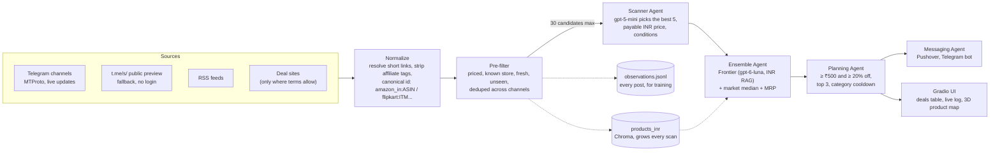

# Autonomous Multi-Agent Bargain Spotter

An India-first deal hunter built from cooperating agents. It reads Indian deal channels on
Telegram (and deal sites that allow it), works out what each product really costs in India
in rupees, and alerts you when something is selling well below that, with an honest
confidence label on every estimate.

No currency conversion happens anywhere: prices come from Indian sources in INR and are
valued against Indian prices in INR.

## How it works



1. **Sources.** The primary source is Telegram deal channels, read as your own account
   through Telethon. New posts arrive live (within seconds) through `events.NewMessage`; a
   5 minute scan covers everything else. Without a login, or for a hosted demo, the public
   `t.me/s/<channel>` preview is used instead. The DealLooto RSS feed is a second source,
   checked every scan. More RSS feeds and HTML deal listings plug in through `sources.yaml`,
   once their robots.txt and terms allow it ([docs/sources.md](docs/sources.md)).
2. **Normalize and pre-filter.** Short links (`amzn.to`, `fkrt.cc`, `bit.ly`, ...) are
   resolved hop by hop without ever loading a store page, affiliate and tracking parameters
   are stripped, and every product gets a canonical id. Regex extracts price, MRP and
   highest past price from formats like `@199`, `Loot 699`, `₹8,988 / 63% off` and
   `Current Price: ₹20,999`. Percentage-only, expired, category and stale posts are dropped,
   and a deal posted by several channels counts once while remembering every channel.
3. **Scanner Agent.** gpt-5-mini sees at most 30 candidates and picks the best five. It
   resolves only what regex cannot: the payable price versus conditional bank, exchange or
   cashback offers (kept in a coupon note), a clean description, category and brand.
4. **Ensemble Agent.** Values each deal with the Frontier Agent (gpt-6-luna asked for the
   typical selling price in India, with similar INR products from the `products_inr` Chroma
   store as context), checked against the median price of close neighbours in that store and
   the MRP scaled down because Indian MRPs are often inflated. Weights are in `settings.yaml`
   (fitted on held-out data: GPT alone for the estimate). Confidence (low, medium, high)
   depends on how many signals exist and whether they agree, and comes with a one-line reason.
5. **Planning Agent.** Keeps deals at least ₹500 and 20% below their estimate, surfaces the
   top three per run with one per category and a category cooldown, and alerts the ones with
   at least medium confidence.
6. **Messaging Agent.** Sends rupee-formatted alerts (store, discount %, confidence, deal age,
   clean link) to Pushover and/or a Telegram bot.

Every parsed post is also appended to `data/observations.jsonl` for future model training,
and every priced deal is added to `products_inr`, so price context improves with each scan.

## Setup

Requires [uv](https://docs.astral.sh/uv/).

```bash
uv sync
cp .env.example .env            # then fill in your keys (see Environment variables)
```

**Telegram channels.** Put your channel list in `sources.local.yaml` (gitignored); see
[Adding a Telegram channel](#adding-a-telegram-channel). Then log in once, in your own
terminal, since Telegram sends you a code:

```bash
uv run python scripts/telegram_login.py     # creates secrets/bargain_spotter.session
uv run python scripts/list_channels.py      # checks every channel resolves
```

Without this step the app still runs, reading username channels through the public preview.

**INR price store.** `products_inr` fills itself as the app runs. To start with context,
seed it from data you have:

```bash
uv run python populate_vectorstore.py --currency INR --from-raw data/raw --exclude amazon_2026   # keep the test set out
uv run python populate_vectorstore.py --currency INR --from-observations   # after a backfill
uv run python populate_vectorstore.py --currency INR --from-memory
```

**History backfill (optional).** Pull 90 days of channel history into the observation log
(resumable and idempotent):

```bash
uv run python scripts/backfill_telegram.py --days 90 --channels all
uv run python scripts/build_labels.py       # one row per product: median, p75, counts, dates
```

## Running

```bash
uv run python price_is_right.py              # live: scans, live Telegram updates, alerts
uv run python price_is_right.py --dry-run    # live sources, no notifications
uv run python price_is_right.py --fixture    # offline demo: replays saved posts, no network
uv run python deal_agent_framework.py --dry-run   # one cycle without the UI
uv run pytest                                # tests, all offline
```

The UI opens at http://127.0.0.1:7860 with a deals table (price, MRP, estimate, discount %,
confidence, store, source, age), a store filter, the live agent log and a 3D t-SNE map of the
product store. On Windows, set `PYTHONIOENCODING=utf-8` if the console cannot print ₹.

## Configuration

| File | Committed | Holds |
| --- | --- | --- |
| `sources.yaml` | yes | Sources, HTTP politeness settings, example channels only |
| `sources.local.yaml` | **no** | Your real channel list, merged on top of `sources.yaml` |
| `settings.yaml` | yes | `pricer_mode`, ensemble weights, thresholds, top N, cooldowns, scan limits |
| `.env` | **no** | API keys and tokens |

### sources.yaml guide

- `telegram`: `public_only` (true for any hosted demo), `live`, `session_path`,
  `channel_delay_seconds`, `max_flood_wait_seconds`, and `channels`.
- `rss`: a list of feeds with `name`, `url` (one or a list), `enabled`, `currency`.
- `aggregators`: HTML listing pages with CSS `selectors` (`item`, `title`, `price`, `mrp`,
  `link`, `store`, `time`, `votes`). A site only runs with `terms_checked: true`.
- `store_apis`: Amazon Creators API and Flipkart Affiliate API, interface stubs, off.
- `http`: User-Agent, timeout, retries, backoff, minimum interval per host, robots.txt.

What was checked for each site, and why most are disabled, is in
[docs/sources.md](docs/sources.md).

### Adding a Telegram channel

Add it to `telegram.channels` in `sources.local.yaml` in one of three forms:

```yaml
telegram:
  channels:
    - username: OMGDeals                  # public: also works without login via t.me/s/
      enabled: true
      trust: 1.0                          # optional quality weight
    - id: -1001234567890                  # numeric id from a Telegram Web URL (MTProto only)
      name: MyPrivateDeals
      enabled: true
    - invite: https://t.me/+AbCdEfGh      # invite link (MTProto only)
      name: InviteDeals
      enabled: true
```

For id and invite channels, join the channel in the Telegram app first; the tool never joins
anything itself and logs a clear message for channels it cannot resolve. Run
`scripts/list_channels.py` to confirm every enabled channel is reachable.

### Environment variables

| Variable | Needed for |
| --- | --- |
| `OPENAI_API_KEY` | Scanner and Frontier agents |
| `TG_API_ID`, `TG_API_HASH` | Reading Telegram as your account (from my.telegram.org) |
| `PUSHOVER_USER`, `PUSHOVER_TOKEN` | Pushover alerts (optional) |
| `TG_BOT_TOKEN`, `TG_CHAT_ID` | Telegram bot alerts (optional) |
| `ANTHROPIC_API_KEY` | Claude-written alerts in the autonomous planner (optional) |
| `PRICER_MODE`, `MIN_DISCOUNT_INR`, `MIN_DISCOUNT_PCT`, `FRESHNESS_HOURS`, `TOP_N_PER_RUN` | Optional overrides of `settings.yaml` |
| `PRICER_PREPROCESSOR_MODEL` | Optional, legacy mode only |

## Why I did not just convert USD to INR

The project started as a US deal hunter whose models estimate "what does this cost in the
US, in dollars". Multiplying that by an exchange rate would look like it works and would be
wrong in ways that matter for a deal alert:

- **Indian prices are not US prices times a rate.** Import duties, GST, local
  manufacturing, India-only models and variants, and regional pricing strategies move prices
  in both directions. An iPhone costs far more in India than its dollar price suggests; many
  Indian-brand appliances have no US equivalent at all.
- **The MRP is not the value.** Indian listings show a printed MRP that is often far above
  any real selling price, so "70% off MRP" says little. The estimate has to come from what the
  product actually sells for in India.
- **A wrong valuation creates false alerts.** A deal hunter is only useful if its alerts are
  trustworthy; a systematic currency bias would flood the user with fake discounts or hide
  real ones.

So valuation in INR mode uses Indian evidence only: an LLM asked for the typical Indian
selling price with similar INR listings as context, checked against nearest neighbours from
a store of real INR listings that grows with every scan and against a discounted MRP, with a
confidence label that says when the evidence is thin. The USD-trained models are kept behind
`PRICER_MODE=usd_legacy` rather than fed into INR valuations.

INR models were then trained and evaluated on public Indian datasets, with a test set
scraped eight months after the training data. GPT with retrieval was clearly the best
estimator (within 20% for 57.5% of test items), the retrained neural network did not beat a
TF-IDF + Ridge baseline, and blending in the market median and MRP made estimates worse, so
the weights in `settings.yaml` now use GPT alone for the estimate and the other signals only
for confidence. The full write-up, including what is weak, is in
[docs/training_report.md](docs/training_report.md) and [docs/data_report.md](docs/data_report.md).

## Reproduce the training

1. Download the datasets (needs a Kaggle account; credentials come from `KAGGLE_USERNAME`
   and `KAGGLE_KEY` or `~/.kaggle/kaggle.json`, never from this repo). Folders that already
   exist in `data/raw/` are skipped:
   ```
   uv sync --all-groups
   uv run python scripts/download_data.py
   ```
2. Check the GPU (PyTorch comes from the CUDA 13.0 index on Windows and Linux):
   `uv run python scripts/check_gpu.py`
3. Clean, split, rebuild the INR store from the train split, evaluate and train:
   ```
   uv run python scripts/prepare_data.py
   uv run python scripts/make_splits.py
   uv run python populate_vectorstore.py --currency INR --reset --from-split data/processed/train.parquet \
       --keep-source telegram: --holdout data/processed/val.parquet data/processed/test.parquet
   uv run python scripts/run_baselines.py
   uv run python scripts/eval_frontier.py
   uv run python scripts/train_nn_inr.py
   uv run python scripts/fit_ensemble.py
   uv run python scripts/evaluate_inr.py
   ```

Every script takes `--help`. `prepare_data.py` and `eval_frontier.py` call OpenAI (about
$0.06 and $0.45, cached, with a spend cap); `train_nn_inr.py` writes its progress to
`models/nn_inr_progress.txt`. `data/` and `models/` are gitignored.

## Data and licences

The INR models were trained and evaluated on these Kaggle datasets. Thanks to their authors.

| Dataset | Author (Kaggle user) | Licence | Used for |
|---|---|---|---|
| [Amazon Electronics and Accessories 2025](https://www.kaggle.com/datasets/prothomeshmistry/amazon-electronics-and-accessories-2025) | prothomeshmistry | MIT | training and validation |
| [Flipkart Electronics Product Dataset 2025](https://www.kaggle.com/datasets/priyankamalavade/flipkart-electronics-product-dataset2025) | priyankamalavade | MIT | training and validation |
| [Flipkart Product Dataset](https://www.kaggle.com/datasets/priyankkhanna/flipkart-product-dataset-by-priyank-khanna) | priyankkhanna (Priyank Khanna) | CC BY 4.0 | training and validation (fashion, footwear and home rows) |
| [Amazon India Electronics Dataset 2026](https://www.kaggle.com/datasets/kulkarniparth09/amazon-india-electronics-dataset-2026) | kulkarniparth09 | Apache 2.0 | test set only |

The raw files are not redistributed here; `scripts/download_data.py` fetches them.

## Legal and ethical notes

- Only public data is read: public Telegram channels (or ones you joined) and pages whose
  robots.txt and terms allow it. Each site was checked and the result recorded in
  [docs/sources.md](docs/sources.md); sites whose terms forbid automated access are disabled.
- robots.txt is respected for every request, including each hop of a redirect chain. Hosts
  that disallow everything (for example DesiDime's short links) are never requested.
- amazon.in and flipkart.com product pages are never scraped. Short links are resolved by
  reading redirect headers, and resolution stops before any store page is requested.
- Affiliate and tracking parameters are stripped, so alerts carry clean store links and never
  pass off a channel owner's affiliate link as your own.
- Your Telegram account is used read-only: no sending, forwarding, reacting or joining.
  The session file and API keys stay in gitignored `secrets/` and `.env`. A personal account
  must never run on a public server; set `telegram.public_only: true` there.
- Requests are rate limited per host, retried with backoff, and FloodWait is honoured.

## Legacy US mode

`PRICER_MODE=usd_legacy` runs the original pipeline unchanged in spirit: DealNews RSS,
a Llama 3.2 preprocessor via Ollama, and a blend (weights in `settings.yaml`) of a fine-tuned
Llama 3.2 on Modal, GPT-5.1 with RAG over the USD `products` collection, and a local neural
network. It needs `ollama serve` with `llama3.2`, `modal deploy pricer_service.py` with a
`huggingface-secret`, `deep_neural_network.pth` in the repo root, and the USD store built
with `populate_vectorstore.py --dataset <hf-user>/<dataset>`.

## Also included

- `agents/autonomous_planning_agent.py`: a planner where GPT drives the workflow itself
  through tool calls (scan, estimate in INR, notify), referring to deals by number, and
  Claude writes the alert.
- `agents/evaluator.py`: a harness that scores a USD price predictor against labelled items;
  `agents/evaluator_inr.py` is the INR version (percent errors, category and price band
  breakdowns, scatter plots).
- `MultiAgent.ipynb` and `results.ipynb`: UI prototypes and a model comparison chart
  (`uv sync --group notebooks`).

## Project layout

```
agents/
  sources/          Telegram (MTProto + public preview), RSS, aggregator, store API stubs, fixtures
  money.py          parse_inr / format_money (Indian digit grouping)
  normalize.py      redirect resolution, affiliate stripping, canonical ids, dedupe
  extraction.py     regex-first candidates and the pre-filter
  scanner_agent.py  candidate selection with gpt-5-mini
  frontier_agent.py INR and USD price estimates
  inr_store.py      products_inr Chroma collection
  price_signal.py   signal blending and confidence
  ensemble_agent.py PRICER_MODE switch
  planning_agent.py thresholds, top N, cooldowns
  messaging_agent.py Pushover and Telegram bot alerts
  taxonomy.py       training categories (separate from the app's), with a mapping
  deep_neural_network.py  residual MLP; INR inference driven by models/nn_inr_meta.json
scripts/            telegram_login, list_channels, backfill_telegram, build_labels,
                    and the training pipeline (download_data ... evaluate_inr)
tests/              offline tests and fixtures (real Telegram posts and previews)
docs/sources.md     what each source allows, verified
docs/data_report.md, docs/training_report.md   the INR datasets and model evaluation
```
