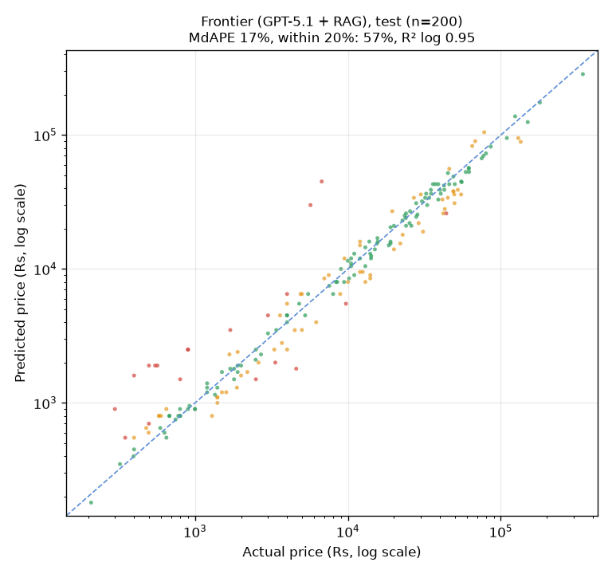
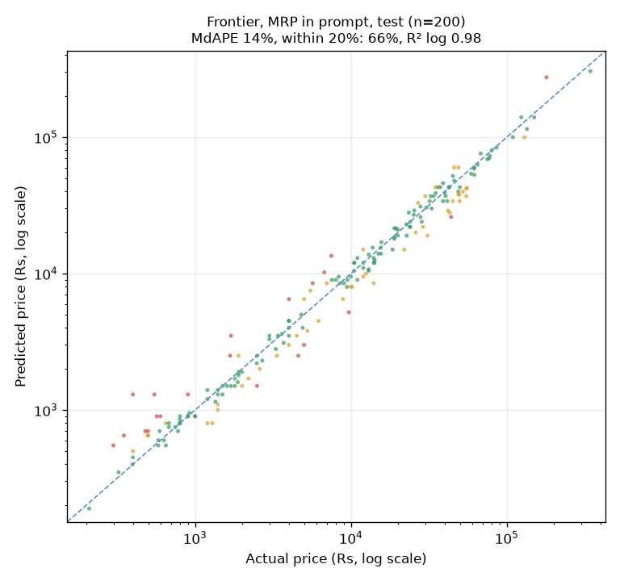
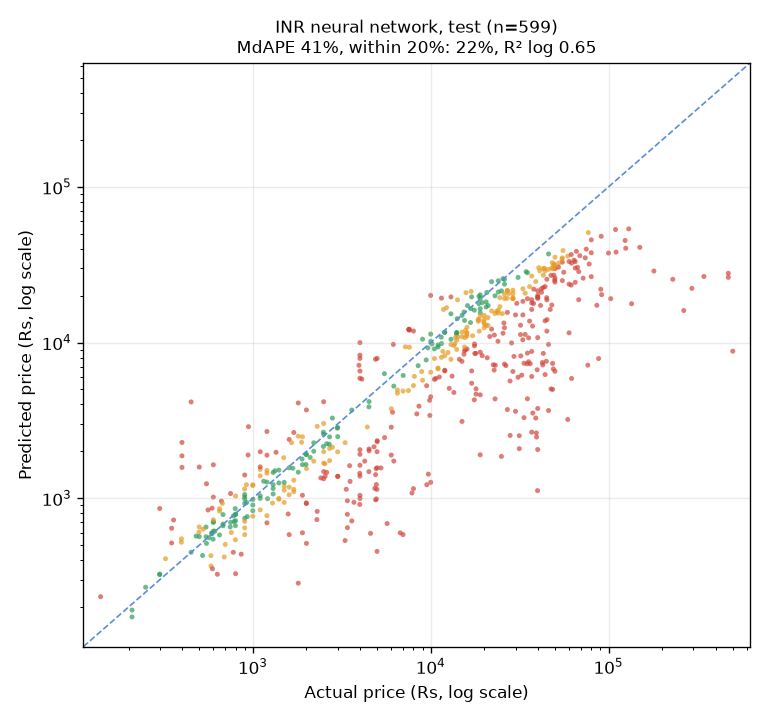
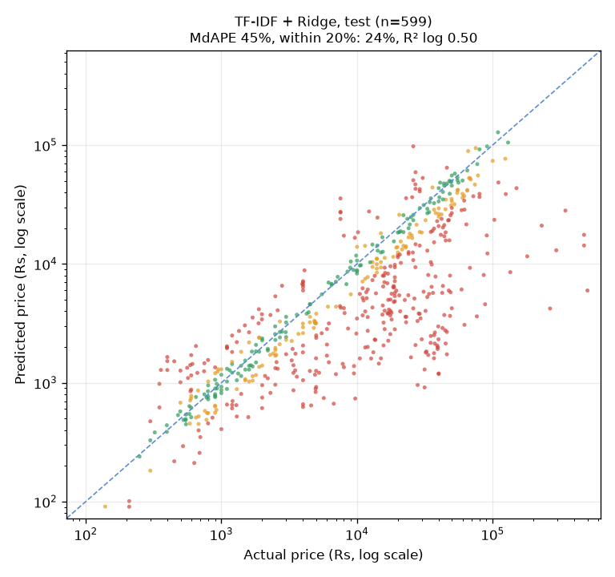
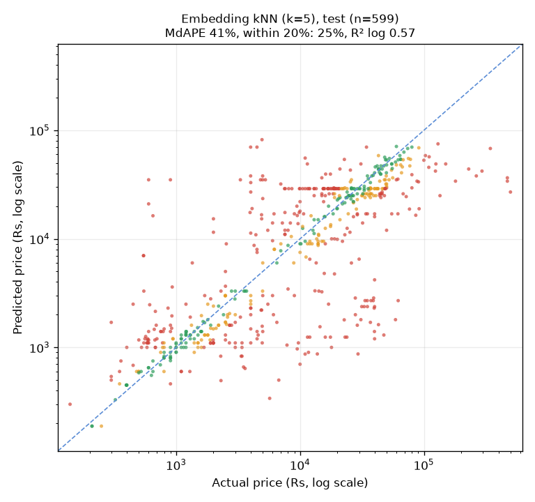
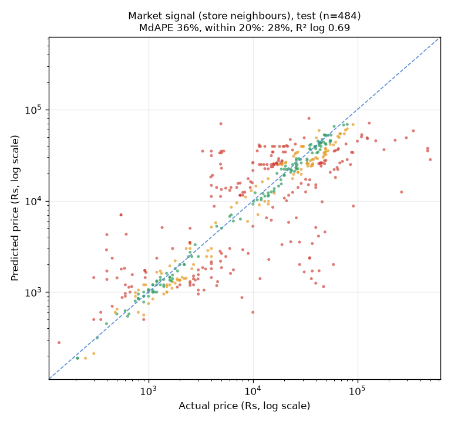

# Training report: INR pricing models (Phase A)

How well can we estimate the normal selling price of an Indian product, in rupees, from its
title? This report compares simple baselines, a retrained neural network and GPT with
retrieval on a held-out set scraped eight months after the training data, and explains the
ensemble weights now in `settings.yaml`. Data details are in [data_report.md](data_report.md).

## Summary

- **GPT-5.1 with INR retrieval (the Frontier Agent) is by far the best estimator**: on the
  June 2026 Amazon test sample it is within 20% of the real price for 57.5% of items (median
  error 16.7%). The best model without an LLM gets 24 to 28% of items within 20%.
- **The retrained neural network does not beat TF-IDF + Ridge on validation** (mean |log
  error| 0.356 against 0.350) and adds nothing measurable on top of GPT. It is not enabled.
- **The old blend made estimates worse.** The current weights (GPT 0.6, market 0.3, MRP 0.1)
  have a median error of 20.2% on the test sample against 16.7% for GPT alone, and the gap
  holds on validation (paired bootstrap, 95% intervals exclude zero on both). The fitted
  weights are GPT 1.0 and 0 for the rest. Market and MRP still feed the confidence label,
  so alerting behaves as before.
- **No sign that GPT echoes MRPs** on the test set: its median predicted/actual ratio is 1.00,
  and it equals an MRP from its context in 1 of 200 answers. With the item's own MRP in the
  prompt it gets *better* (median error 14.3%). No calibration factor is needed.
- **The confidence label is not reliable out of distribution.** On validation, items where
  GPT and the market agree have 9% median error against 17% for "low". On the test set
  "high" items have 20% error against 15% for "low".
- **Biggest weakness: the training data does not match what the app prices.** Training is
  mostly cheap accessories and old fashion listings; the test set is 24% large appliances
  (7 training examples); live Telegram deals are mostly cheap groceries, beauty and home
  items that no dataset covers. On 5,933 Telegram products every free model is off by a
  median of 66% or more.

Recommendation: **do not enable the neural network.** Keep GPT as the estimator and invest
in data (more categories, current prices) before more model work. Details below.

## Setup

- GPU: RTX 5070 Ti (16 GB, Blackwell sm_120), driver 617.14, PyTorch 2.14.1+cu130 from the
  PyTorch CUDA 13.0 index (`[tool.uv.sources]` in `pyproject.toml`; `scripts/check_gpu.py`).
- Data: 11,279 train, 1,254 validation, 599 test products (see the data report).
- All choices (Ridge alpha, network size, inputs, ensemble weights) were made on validation.
  The test set was only used to report.
- GPT-5.1 was run on fixed random samples (seed 42) because it costs money: 200 test items,
  the same 200 with the MRP added, and 300 validation items. RAG context came from
  `products_inr` rebuilt from the train split only (plus 367 live Telegram rows, minus 3 that
  matched validation or test products), so no held-out product was ever in the context.
- Spend: GPT-5.1 evaluation about $0.44 (686 calls including a 10-call smoke test, cap $3); gpt-5-mini categories about
  $0.09. Total about $0.53.

## Results on the test set (amazon_2026, June 2026)

### Same 200 sampled items, every model

| model | n | MAE (Rs) | median APE | within 10% | within 20% | R² (log) | median pred/actual |
|---|---|---|---|---|---|---|---|
| Category median | 200 | 12,404 | 56.2% | 7.5% | 19.0% | 0.495 | 0.79 |
| TF-IDF + Ridge | 200 | 12,676 | 43.0% | 11.0% | 24.0% | 0.564 | 0.65 |
| Embedding kNN (k=5) | 200 | 12,525 | 39.5% | 11.0% | 27.5% | 0.631 | 0.89 |
| Market signal (store neighbours) | 155 | 13,399 | 34.3% | 14.2% | 29.0% | 0.736 | 0.91 |
| INR neural network | 200 | 12,860 | 40.0% | 9.5% | 23.0% | 0.711 | 0.67 |
| Old ensemble weights (GPT 0.6, market 0.3, MRP 0.1) | 200 | | 20.2% | | 49.5% | | |
| **Frontier (GPT-5.1 + RAG) = fitted ensemble** | 200 | 4,221 | **16.7%** | 27.5% | **57.5%** | 0.950 | 1.00 |
| Frontier, MRP in the prompt | 200 | 3,609 | 14.3% | 34.5% | 66.0% | 0.977 | 0.97 |

The market signal only exists when at least 3 store items are within cosine distance 0.45,
which is true for 155 of the 200. The old ensemble row comes from `scripts/fit_ensemble.py`,
which reports median APE and within 20% only.

### All 599 test items, free models

| model | n | MAE (Rs) | median APE | within 10% | within 20% | R² (log) | median pred/actual |
|---|---|---|---|---|---|---|---|
| Category median | 599 | 14,358 | 53.9% | 7.7% | 16.7% | 0.374 | 0.74 |
| TF-IDF + Ridge | 599 | 14,553 | 44.8% | 11.7% | 24.2% | 0.500 | 0.66 |
| Embedding kNN (k=5) | 599 | 13,951 | 41.5% | 13.0% | 24.9% | 0.570 | 0.91 |
| Market signal (store neighbours) | 484 | 14,629 | 36.2% | 15.3% | 28.3% | 0.687 | 0.91 |
| INR neural network | 599 | 14,661 | 41.4% | 11.0% | 22.4% | 0.653 | 0.66 |

Models trained on this data underestimate test prices (median ratio 0.66 for Ridge and the
network). That is the shift from cheap accessories to appliances and from festive-sale
prices to June prices, not a scale bug: the same models are unbiased on validation (ratio 1.00).

### Validation (for comparison)

| model | n | median APE | within 20% | R² (log) |
|---|---|---|---|---|
| Category median | 1,254 | 55.1% | 20.3% | 0.538 |
| TF-IDF + Ridge (alpha 0.1) | 1,254 | 23.4% | 45.3% | 0.896 |
| Embedding kNN (k=5) | 1,254 | 25.0% | 43.4% | 0.867 |
| INR neural network | 1,254 | 25.5% | 40.8% | 0.896 |
| Frontier (300 sampled) | 300 | 12.7% | 64.0% | 0.970 |

The trained models lose 16 to 21 points of median error from validation to test (the category median was poor on both). GPT loses the
least (12.7% to 16.7%).

### By category (median APE, test)

Sampled items, every model:

| category | n | Category median | TF-IDF + Ridge | kNN | Market | Neural net | Frontier | Frontier + MRP |
|---|---|---|---|---|---|---|---|---|
| large_appliance | 45 | 37% | 84% | 81% | 71% | 65% | 12% | 9% |
| other (mostly gaming consoles) | 35 | 82% | 43% | 72% | 100% | 57% | 26% | 17% |
| earbuds_headphones | 27 | 67% | 20% | 27% | 33% | 19% | 15% | 15% |
| laptop | 21 | 19% | 29% | 23% | 28% | 48% | 25% | 22% |
| smartphone | 17 | 31% | 23% | 24% | 24% | 32% | 24% | 20% |
| tv | 14 | 64% | 39% | 39% | 40% | 24% | 13% | 13% |
| tablet | 14 | 59% | 37% | 51% | 48% | 42% | 14% | 19% |
| smartwatch | 13 | 48% | 28% | 21% | 25% | 38% | 13% | 13% |
| camera | 8 | 59% | 43% | 39% | 35% | 15% | 27% | 19% |
| mobile_accessory | 4 | 64% | 62% | 13% | 12% | 56% | 9% | 6% |
| computer_accessory | 2 | 98% | 42% | 89% | 74% | 57% | 14% | 11% |

Whole test set, free models:

| category | n | Category median | TF-IDF + Ridge | kNN | Market | Neural net |
|---|---|---|---|---|---|---|
| large_appliance | 143 | 39% | 79% | 55% | 47% | 57% |
| other | 91 | 85% | 43% | 73% | 70% | 57% |
| earbuds_headphones | 79 | 59% | 28% | 32% | 33% | 23% |
| smartphone | 52 | 33% | 39% | 27% | 24% | 33% |
| tv | 45 | 64% | 27% | 41% | 44% | 33% |
| smartwatch | 43 | 56% | 32% | 21% | 21% | 30% |
| laptop | 43 | 26% | 33% | 18% | 23% | 47% |
| tablet | 43 | 61% | 38% | 50% | 52% | 45% |
| camera | 38 | 92% | 49% | 41% | 37% | 32% |
| mobile_accessory | 13 | 73% | 39% | 16% | 17% | 21% |
| computer_accessory | 9 | 97% | 45% | 75% | 51% | 62% |

Large appliances show the data gap most clearly: with 7 training examples, every
data-driven model misses by 47 to 84%, while GPT, which knows appliance prices, misses by
12%. Where training data is plentiful (earbuds, phones, smartwatches, accessories), the
free models are within a few points of GPT.

### By price band (median APE, test)

| price band | n (sample) | TF-IDF + Ridge | kNN | Market | Neural net | Frontier | Frontier + MRP |
|---|---|---|---|---|---|---|---|
| under Rs 1k | 35 | 34% | 21% | 28% | 22% | 18% | 13% |
| Rs 1k to 10k | 66 | 42% | 45% | 40% | 46% | 20% | 16% |
| Rs 10k to 50k | 77 | 52% | 34% | 30% | 37% | 15% | 14% |
| over Rs 50k | 22 | 39% | 50% | 46% | 57% | 16% | 10% |

On the whole test set the network is best of the free models under Rs 1k (21%, n = 93) and
poor over Rs 50k (60%, n = 58), where it has little training data.

### Plots

Truth against prediction on log axes; green within 20%, orange within 40%, red beyond.

| | |
|---|---|
|  |  |
|  |  |
|  |  |

The red points at the bottom left of the Frontier plot are cheap items (under Rs 1,000)
that GPT prices 2 to 4 times too high. This matches what was seen live (an AKAI speaker
estimated at Rs 1,499).

## The neural network

`scripts/train_nn_inr.py` reuses `DeepNeuralNetwork` (residual MLP) at smaller sizes. Target:
log1p(price), standardised with the train mean and std, which are saved in
`models/nn_inr_meta.json` (no hardcoded constants). Huber loss, AdamW (weight decay 0.01),
batch 128, dropout 0.3, learning rate halved on plateaus, early stopping after 20 epochs
without validation improvement, seed 42. Inputs always include a taxonomy one-hot (at
inference the category comes from the title rules, then the app's category).

| inputs | size | lr | val mean \|log err\| | val median APE | best epoch / run | s per epoch | peak GPU MB | params |
|---|---|---|---|---|---|---|---|---|
| hashing+embeddings | 512x6 | 0.001 | **0.356** | 25.5% | 27/47 | 0.24 | 480 | 4.9M |
| hashing | 512x6 | 0.001 | 0.357 | 24.4% | 83/103 | 0.25 | 435 | 4.7M |
| hashing+embeddings | 512x6 | 0.0003 | 0.362 | 27.0% | 36/56 | 0.25 | 453 | 4.9M |
| hashing+embeddings | 256x4 | 0.001 | 0.368 | 28.0% | 10/30 | 0.18 | 494 | 1.6M |
| hashing+embeddings | 512x4 | 0.001 | 0.369 | 25.9% | 50/70 | 0.17 | 444 | 3.8M |
| hashing | 1024x6 | 0.001 | 0.381 | 27.9% | 25/45 | 0.28 | 673 | 13.6M |
| hashing | 256x4 | 0.001 | 0.385 | 28.3% | 24/44 | 0.19 | 334 | 1.6M |
| hashing+embeddings | 1024x4 | 0.001 | 0.396 | 28.7% | 75/95 | 0.18 | 583 | 9.7M |
| hashing | 1024x4 | 0.001 | 0.424 | 32.7% | 11/31 | 0.19 | 556 | 9.3M |
| (11 more runs) | | | 0.384 to 0.469 | | | | | |

The full grid is in `models/nn_inr_search.json` (20 runs, 3.5 minutes on the GPU, under
750 MB of GPU memory each). Observations:

- Hashing+embeddings won narrowly, as the prompt asked to compare. The gap to hashing alone
  (0.356 against 0.357) is smaller than the spread between configurations, which jump around
  with early stopping. One seed per configuration was run, so the ranking within about 0.01
  is noise.
- Bigger is not better: 1024-wide models did worse than 512-wide. The USD size (4096 x 10)
  was not tried; with 11k rows it would only overfit harder.
- **It does not beat TF-IDF + Ridge** (0.350 on validation), a model that trains in seconds
  on a CPU. On test it is slightly better than Ridge overall (41.4% against 44.8% median
  error) but worse on laptops, and that difference was not used for any choice.

## Ensemble weights

`scripts/fit_ensemble.py` simulates the app's own `value_inr` on the 300 validation items
with a GPT answer, so missing signals are renormalised exactly as in production. Weights are
non-negative, sum to 1 and are searched on a 0.05 grid over frontier, market, neural_network
and mrp. A signal is dropped when removing it raises validation mean |log error| by less
than 0.002.

| weights | val mean \|log err\| |
|---|---|
| best of all four (GPT 0.95, network 0.05) | 0.1909 |
| without market | 0.1909 (dropped) |
| then without the network | 0.1915 (dropped) |
| then without MRP: **GPT alone** | 0.1918 (dropped) |
| old weights (GPT 0.6, market 0.3, MRP 0.1) | 0.229 |

Every extra signal improves validation error by less than 0.001, and the old weights are
clearly worse (paired bootstrap of mean |log error|, old minus fitted: +0.037 on validation,
95% interval 0.021 to 0.054; +0.052 on test, 0.021 to 0.083). `settings.yaml` now has
frontier 1.0 and market, mrp and neural_network 0.

Weights also decided confidence before this change, because only weighted signals were
compared. With market at 0 every deal would have become "low" and stopped alerting.
`value_inr` now always computes market and MRP and uses them as checks: they decide
confidence but not the estimate. If GPT fails, the checks become the estimate. The confidence
mix is unchanged (validation 55% high, 19% medium, 25% low; test 33% / 24% / 43%).

### Does the confidence label mean anything?

Median APE of the final estimate by confidence label:

| | high | medium | low |
|---|---|---|---|
| validation (300) | 9.1% | 12.8% | 17.0% |
| test (200) | 19.9% | 14.8% | 15.3% |

On validation, agreement between GPT and the market picks out the accurate estimates. On
the test set it does not. One reason is that the two are not independent: GPT sees the same
neighbours in its prompt that make the market median, so when the neighbours are misleading
both are wrong together. In about 15% of test answers GPT returned a neighbour's price
exactly. The network's agreement with GPT behaves the same way (validation 9% against 17%,
test 20% against 15%), so it would not make a good second signal either.

## Frontier bias and the MRP question

Addendum notes 14 and 15 asked whether GPT returns MRPs or launch prices instead of
selling prices.

- **Bias**: median predicted/actual is 1.00 on both validation and test (10th to 90th
  percentile on test: 0.70 to 1.38). No systematic overestimate, so no calibration factor
  was added. The overestimates that exist are concentrated under Rs 1,000.
- **Echoing MRPs from the context**: 31 of the 200 test prompts had an MRP among the RAG
  neighbours; GPT's answer equalled one of them once (and 5 times in 300 validation answers).
- **With the item's own MRP in the prompt** ("MRP: ₹79,900" appended to the description): the median ratio drops
  slightly to 0.97, no answer equals the MRP (the median MRP is 1.75 times the price), and
  accuracy improves from 16.7% to 14.3% median error. The MRP helps GPT locate the product
  rather than pulling it up.

So the test set does not reproduce the MRP-like estimates seen live (Ray-Ban Meta Rs 29,990,
AKAI speaker Rs 1,499). The likely difference is the items: the test set is mainstream
Amazon electronics GPT knows well, while live deals are niche, cheap or new products, and
deal posts often quote the MRP right next to the deal price. The cheap-item overestimates in
the scatter plot are the closest match. A Frontier evaluation on Telegram products was not
run (it would cost money and their labels are deal prices); it is the natural next check.

## Separate check: products from Telegram deal posts

`scripts/eval_telegram_labels.py` scores the free models on the 5,933 products in
`data/labels.csv` with a real Amazon or Flipkart id that are not in the train split. Their
labels are **deal prices** (median of the posts), so a good model should predict *above*
them. This is not a test score.

| model | median APE | within 20% | median predicted / deal price |
|---|---|---|---|
| Category median | 71.6% | 12.3% | 0.87 |
| TF-IDF + Ridge | 73.2% | 13.7% | 1.10 |
| Embedding kNN | 66.3% | 16.2% | 1.00 |
| INR neural network | 66.2% | 15.1% | 1.03 |

63% of these products cost under Rs 1,000 and 44% fall in "other" (groceries, beauty,
supplements, toys), which no training dataset covers. The network pulls everything towards
the middle: it predicts 1.66 times the deal price under Rs 1,000 and 0.13 times over Rs
50,000. None of these models is a usable second signal for live deals.

## What is weak

- **Festive sale prices in training.** amazon_2025 was scraped on 2025-10-06, during Amazon's
  Great Indian Festival, and has no MRP, so sale and normal prices cannot be told apart.
  Part of the test underestimate (ratio 0.66 for Ridge) is probably this.
- **Old prices.** flipkart_khanna is about four years old (and has no dates); flipkart_2025
  is from July 2025. Indian prices have risen since.
- **Coverage.** 7 large appliances in training against 143 in test; no groceries, beauty,
  toys or sports anywhere; fashion only from the old khanna crawl.
- **Short titles.** Flipkart titles are cut at about 60 characters, losing model numbers.
- **Small GPT samples.** 200 test and 300 validation items give wide intervals (for example
  ±7 points on "within 20%"). Ensemble differences under 0.001 are noise.
- **Validation is in-distribution and RAG makes it easier.** Validation items often have a
  colour or storage sibling in the train split, so GPT and kNN can copy a close price. Test
  numbers are the honest ones.
- **One seed per network configuration**, so the network ranking is noisy.
- **The test set is a search crawl**, with 15% gaming consoles and a few extreme cameras
  (two over Rs 5 lakh were removed as outliers).

## Recommendation

1. **Do not enable the neural network.** It does not beat a TF-IDF + Ridge baseline on
   validation, it adds nothing on top of GPT, its agreement with GPT does not predict
   accuracy out of distribution, and it fails on live deal products. The code path is in
   place (`ensemble.inr.neural_network` above 0 loads `models/nn_inr.pth`) if better data
   changes this.
2. **Keep the new weights** (GPT alone for the estimate, market and MRP as confidence checks).
   They are better on validation and test.
3. **Treat "high confidence" with care.** It is well calibrated on data like the training
   data, not on the 2026 test set. A useful next step is to measure it on surfaced live deals
   whose real price can be checked.
4. **Consider adding the MRP to GPT's prompt** for live deals that have one. It improved
   accuracy here (16.7% to 14.3%), but deal posts are not catalogue listings, so check on
   live deals first.
5. **Spend effort on data before models**: a current scrape that covers appliances,
   groceries, beauty and fashion at normal (non-sale) prices would help every model, and
   Phase B (fine-tuning Llama) will hit the same data limits.

## Reproduce

```
uv sync --all-groups
uv run python scripts/check_gpu.py
uv run python scripts/download_data.py          # skips folders that already exist
uv run python scripts/prepare_data.py           # about $0.06 of gpt-5-mini, cached
uv run python scripts/make_splits.py
uv run python populate_vectorstore.py --currency INR --reset --from-split data/processed/train.parquet \
    --keep-source telegram: --holdout data/processed/val.parquet data/processed/test.parquet
uv run python scripts/run_baselines.py
uv run python scripts/eval_frontier.py          # about $0.45 of gpt-5.1, cached, capped at $3
uv run python scripts/train_nn_inr.py           # progress in models/nn_inr_progress.txt
uv run python scripts/fit_ensemble.py
uv run python scripts/evaluate_inr.py           # tables and docs/images/*.png
uv run python scripts/eval_telegram_labels.py   # optional, needs data/labels.csv
```
